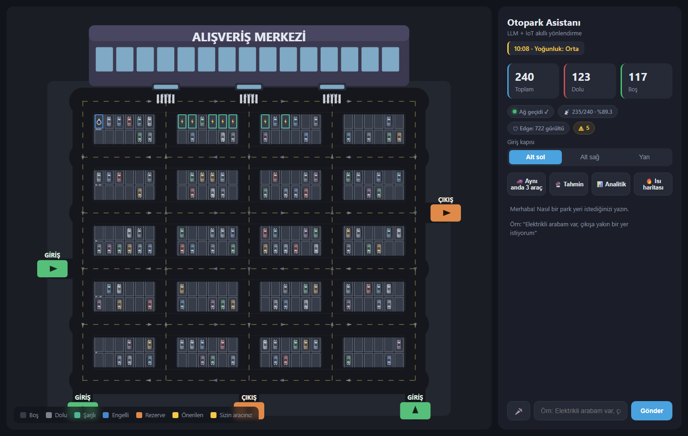
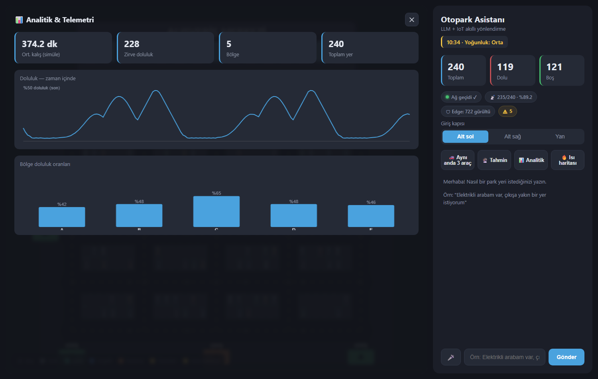

# 🅿️ Akıllı Otopark Yönlendirme Sistemi (LLM + IoT)

Sürücü doğal dille konuşur (*"elektrikli arabam var, 2 saat kalacağım"*), bir
**LLM** isteği anlar ve **function calling** ile yönlendirme algoritmasını çağırır.
Algoritma graf üzerinde **A\*** mesafeleri ve **kalış süresi odaklı bir maliyet
fonksiyonu** ile en uygun boş park yerini bulur; sonuç hem doğal dille açıklanır
hem de **web tabanlı 2D simülasyonda** (FastAPI + Canvas) canlı gösterilir.

> 🎓 "Nesnelerin Yapay Zekası (AIoT)" dersi dönem projesi — Yapay Zeka ve Veri
> Mühendisliği.

> 🧠 **Temel ilke:** *LLM karar vermez — anlar ve açıklar. Kararı deterministik
> algoritma (A\* + maliyet fonksiyonu) verir.*



---

## ✨ Öne çıkan özellikler

**Yapay zekâ & yönlendirme**
- 🗣️ **Konuşan LLM asistanı** (Gemini function calling) — üç araç: yer bulma,
  doluluk sorgulama, doluluk tahmini. Türkçe + İngilizce.
- 🧮 **A\* + maliyet fonksiyonu** `C_i = |d_i − α·t|` ile yer seçimi (kısa kalan
  kapıya yakın, uzun kalan derine → sirkülasyon).
- 🚗 **Çoklu araç optimal atama** (Hungarian / Kuhn-Munkres) — aynı anda gelen
  araçlar çakışmadan en uygun yerlere dağıtılır.
- 🔮 **Tahminleyici zekâ** — geçmiş örüntü + eğilimle "15 dk sonra ~%X dolu".

**IoT / AIoT katmanı**
- 📡 **MQTT** hiyerarşik topic'ler (`otopark/spots/<bölüm>/<id>`), **QoS 1**,
  **retained**, **Last Will (LWT)** — ağ geçidi çökerse otomatik "offline".
- 🛡️ **Edge AI** — sensör düğümü ham veriyi merkeze yollamadan önce yerel
  **debounce** uygular; geçici geçişleri (pass-by gürültüsü) uçta filtreler.
- 🩺 **Sensör sağlık telemetrisi** + **anomali tespiti** (çevrimdışı/takılı
  sensör, düşük pil) → kestirimci bakım.
- 📊 **Analitik panel** — doluluk zaman serisi, bölge oranları, ısı haritası,
  ortalama kalış süresi.
- 🎫 **Rezervasyon**, 🎤 **sesli giriş** (Web Speech API tr-TR).

**Mühendislik olgunluğu**
- ✅ **Pydantic** ile veri doğrulama (MQTT mesajları + LLM parametreleri).
- 📝 Merkezi **logging**, 🔒 thread **kilidi**, 🔁 MQTT **yeniden bağlanma**.
- 🗂️ **Karar/oturum log tablosu** (her yönlendirme: parametre → sonuç).
- 🧪 **37 pytest** testi.



---

## 🏛️ Mimari

```
┌──────────────────────┐   MQTT (QoS1/retain/LWT)   ┌──────────────────────────┐
│  Sensör Simülatörü   │ ─────────────────────────► │        Backend           │
│  + Edge AI (debounce)│   otopark/spots/<böl>/<id> │  - MQTT abonesi          │
│  + sağlık telemetrisi│   otopark/health/<id>      │  - SQLite (doluluk+log)  │
└──────────────────────┘   otopark/gateway/status   │  - A* + maliyet fonk.    │
                                                     │  - LLM orchestrator      │
┌──────────────────────┐    REST + WebSocket        │  - anomali / analitik /  │
│  Web Arayüzü         │ ◄────────────────────────► │    tahmin                │
│  (FastAPI + Canvas)  │                            └──────────────────────────┘
└──────────────────────┘
(alternatif: Pygame masaüstü)
```

Üç katman:
- **IoT:** park yeri sensör simülasyonu + MQTT yayını + SQLite. Broker yoksa
  doluluk doğrudan DB'ye yazılır (brokersız yedek), sayılar yine canlı akar.
- **Algoritma:** graf üzerinde A* mesafeleri; **kalış süresi maliyet fonksiyonu**
  ile yer seçimi; çoklu araç için Hungarian optimal atama.
- **LLM:** doğal dili yapılandırılmış parametreye çevirir, sonucu açıklar.
  *(Karar algoritmaya aittir; LLM yalnızca anlar + açıklar.)*

### Maliyet fonksiyonu (karar çekirdeği)

Her boş park yeri `P_i` için maliyet: **`C_i = |d_i − α·t|`**
- `d_i`: aracın girdiği kapıdan yere A* sürüş mesafesi
- `t`: tahmini kalış süresi (saat)
- `α`: mesafe-zaman ağırlık katsayısı (`config.ALPHA_DISTANCE_PER_HOUR`)

En küçük `C_i`'li boş yer atanır → kapı önleri kısa kalanlara ayrılır, sirkülasyon
artar. Süre verilmezse tercihe (girişe/çıkışa yakın) göre en yakın yer seçilir.

### Edge AI (uç zekâ)

Klasik IoT'de ham veri buluta gider, karar merkezde verilir. Burada sensör
**düğümünde** basit bir karar verilir: bir park yeri sensörü, önünden geçen
kısa süreli hareketleri (yaya/araç) gerçek park etmeden **debounce** ile ayırır.
Yalnızca birkaç tur kararlı kalan değişiklik "gerçek" sayılıp yayınlanır; geçici
sıçramalar **uçta filtrelenir** (arayüzde "🛡 Edge: N gürültü" olarak görünür).
→ *bulut zekâsı (LLM) ↔ uç zekâsı (sensör mantığı)* ayrımının somut örneği.

---

## ⚙️ Teknoloji yığını

Python 3.11+ · paho-mqtt + Mosquitto · SQLite · FastAPI + WebSocket + Canvas ·
Pydantic · Google Gemini (function calling) · pytest · Pygame (alternatif arayüz)

---

## 🚀 Kurulum

### 1. Sanal ortam ve bağımlılıklar

```powershell
python -m venv venv
venv\Scripts\activate          # Windows PowerShell
# source venv/bin/activate     # Linux / macOS
pip install -r requirements.txt
```

### 2. Ortam değişkenleri

`.env.example` dosyasını `.env` olarak kopyala ve doldur:

```powershell
copy .env.example .env         # Windows
# cp .env.example .env         # Linux / macOS
```

Varsayılan sağlayıcı **gemini** (`LLM_PROVIDER=gemini`); `GEMINI_API_KEY`'i `.env`'e
gir ([Google AI Studio](https://aistudio.google.com/apikey)'dan ücretsiz alınır).
Alternatif: `ollama` (yerel/ücretsiz), `openai`, `anthropic`.

> 💡 Gemini ücretsiz katmanı **20 istek/gün**'dür. Demoda kotayı 2 kat uzatmak
> için `.env`'de `LLM_EXPLAIN=false` yapabilirsin (tek LLM çağrısı + zengin şablon
> açıklama). Kota dolsa bile sistem **anahtar-kelime yedeğiyle** çalışmaya devam eder.

### 3. Mosquitto MQTT broker (yerel)

IoT katmanı yerel bir MQTT broker'a ihtiyaç duyar (broker yoksa sistem brokersız
yedeğe düşer, yine çalışır).

**Windows:** [mosquitto.org/download](https://mosquitto.org/download/)'dan kur
(servis olarak kurarsan otomatik çalışır). Kontrol: `Get-Service mosquitto`

**Linux:** `sudo apt install mosquitto && sudo systemctl start mosquitto`

**macOS:** `brew install mosquitto && brew services start mosquitto`

### 4. (Opsiyonel) Ollama — yerel/ücretsiz LLM

```bash
# https://ollama.com/download adresinden kur, sonra:
ollama pull llama3.1
```
`.env`'de `LLM_PROVIDER=ollama` yap.

---

## ▶️ Çalıştırma

```powershell
python main.py            # web arayüzü -> http://127.0.0.1:8000  (önerilen)
python main.py --pygame   # alternatif Pygame masaüstü arayüzü
```

Web sunucusu açıldığında sensör simülatörü ve MQTT abonesi **otomatik başlar**.
Tarayıcıda `http://127.0.0.1:8000` adresini aç. Sağ panelden giriş kapısını seç ve
doğal dille park isteğini yaz.

**Örnek istemler:**
- *"Elektrikli arabam var, şarja yakın bir yer istiyorum"*
- *"Engelliyim, girişe yakın olsun"*
- *"8 saat kalacağım, bir yer ver"* → daha derinde bir yer (maliyet fonksiyonu)
- *"Kaç boş yer var?"* → doluluk sorgusu (yönlendirme yok)
- *"Birazdan otopark dolar mı?"* → tahmin
- Butonlar: **🚗 Aynı anda 3 araç**, **🔮 Tahmin**, **📊 Analitik**, **🔥 Isı haritası**

---

## 🧪 Testler

```powershell
pytest                    # 37 test
```

---

## 📁 Klasör yapısı

```
simulator/   Sensör simülasyonu (MQTT yayını + Edge AI debounce + brokersız yedek)
backend/     MQTT abonesi, SQLite, anomali, analitik, tahmin, şemalar, logging
algorithm/   Graf, A*, maliyet fonksiyonu, Hungarian çoklu atama
llm/         Function calling araçları (3), sağlayıcı soyutlaması, orchestrator
web/         FastAPI sunucu + Canvas 2D simülasyon (birincil arayüz)
ui/          Pygame masaüstü arayüzü (alternatif)
tests/       pytest testleri
docs/        Ekran görüntüleri
config.py    Tüm ayarlar (ALPHA, edge debounce, MQTT, eşikler...)
main.py      Giriş noktası
```

### Başlıca API uçları

| Uç | Açıklama |
|---|---|
| `GET /api/layout` | Statik otopark yerleşimi (yerler, yollar, kapılar) |
| `GET /api/state` | Anlık doluluk + sensör/ağ geçidi/edge/anomali durumu |
| `WS  /ws` | Canlı doluluk akışı |
| `POST /api/request` | Doğal dil isteği → LLM → yönlendirme/sorgu/tahmin |
| `POST /api/request_multi` | Çoklu araç optimal atama (Hungarian) |
| `GET /api/predict` | Kısa vadeli doluluk tahmini |
| `GET /api/anomalies` | Sensör anomalileri + filo özeti |
| `GET /api/analytics` | Zaman serisi, bölge oranları, ısı haritası |
| `POST /api/reserve` · `/api/cancel_reservation` | Rezervasyon |
| `GET /api/assignments` | Yönlendirme karar logu (denetim izi) |

---

## 📌 Durum

Çalışan prototip. Detaylı ilerleme ve karar geçmişi `CLAUDE.md` →
"İlerleme Durumu" bölümünde.
